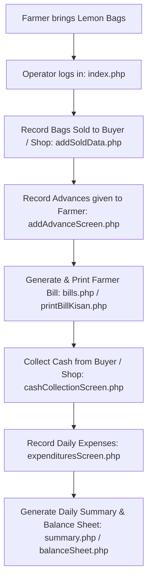

# Comprehensive Guide: How this PHP Application Works

Welcome to the documentation for the **Lemon Commission Agent System (LC / Lemons)**! This guide is specially designed for beginners to help you understand what this project does, how its files interact, and how PHP and MySQL work together under the hood.

---

## 1. Executive Summary & Business Purpose

### What is this project?
This application is a **Mandi Commission Agent Management System** (specifically configured for **Lemon & Fruit Exports** in Nakrekal). 

In agricultural markets (Mandis):
1. **Farmers (Kisans)** bring produce (bags of lemons) to the commission agent's mandi.
2. The commission agent sells these bags to **Buyer Shops / Lorry Buyers** (e.g. buyers from Delhi, Bangalore, Mysuru, Mumbai, etc.) or retail buyers (**Local Sale**).
3. The agent deducts **Commission %**, **Hamali** (coolie/loader labor fees), **ICF** (Market/Cess fees), and any **Advances** previously given to the farmer.
4. The agent pays the remaining balance to the farmer, generates printed bills, tracks expenses, collects cash from buyers, and computes daily **Balance Sheets**.

---

## 2. Technical Stack & Architecture

| Layer | Technology Used | Description |
| :--- | :--- | :--- |
| **Backend** | **PHP** (Procedural) | Processes forms, manages user sessions, and executes database queries. |
| **Database** | **MySQL** (`mysqli`) | Stores farmers, shops, sales, advances, expenditures, cash collections, and user logins. Database name: `lemons`. |
| **Routing** | **Apache `.htaccess`** | Uses `mod_rewrite` to clean URLs (e.g. `localhost/LC/home` maps to `home.php`). |
| **Frontend UI** | **HTML5 & CSS3** | Custom styled tables, forms, and layout (`style.css`, `localSale.css`, `global.css`, `print.css`). |
| **Interactivity** | **JavaScript & AJAX** | Uses `XMLHttpRequest` and jQuery to load billing tables, reports, and search results asynchronously without full page reloads (`main.js`). |

---

## 3. Understanding Code Obfuscation in this Project

> [!IMPORTANT]
> When opening files like [dbase.php](file:///c:/Users/pavan/Desktop/Free%20Lancer/LC/dbase.php), [index.php](file:///c:/Users/pavan/Desktop/Free%20Lancer/LC/index.php), or [addSoldData.php](file:///c:/Users/pavan/Desktop/Free%20Lancer/LC/addSoldData.php), you will notice code like:
> ```php
> ${"\x47\x4cOB\x41LS"}["\x61lc\x75u\x64\x6fm\x6c\x76\x77"] = new mysqli(...);
> ```
> **What is this?**
> This is **PHP Code Obfuscation** (Hexadecimal encoding). The original developer ran the PHP code through an obfuscator to protect intellectual property.
> - `\x47\x4cOB\x41LS` decodes to `GLOBALS`
> - `\x6coca\x6c\x68o\x73t` decodes to `localhost`
> 
> Despite the obfuscation, standard PHP superglobals (`$_POST`, `$_GET`, `$_SESSION`), HTML tags, SQL query strings, and JavaScript functions (`main.js`) remain visible and fully functional.

---

## 4. Key Workflows & How Data Flows



### Workflow Details:

1. **User Authentication & Session Setup**:
   - The user opens `index` (`index.php`), enters Username and Password.
   - Credentials are evaluated against the `user` table using MD5 password hashing.
   - On success, `$_SESSION` variables are set (User Type: `OPE` for Operator, `ADM` for Admin, Company Name, Commission Rate, Hamali Rate).

2. **Recording Sold Produce (Kisan to Buyer/Shop)**:
   - File: `addSoldData.php` / `getSoldData.php` / `submitSoldPrice.php`
   - Operator selects Date, Farmer Name, Buyer City/Shop, No. of Bags, Lorry Number, Transportation Charges, Commission %, and Hamali.
   - Data is stored in the `inventory` table (type `RSELL`).

3. **Billing Farmers**:
   - Files: `bills.php`, `getBills.php`, `printBillKisan.php`
   - Calculates Total Bag Amount = $\sum (\text{Bags} \times \text{Price})$.
   - Deducts Commission %, Hamali, ICF, Lorry Advance, and previous Advances.
   - Computes Net Payable Amount to the farmer and prints a physical receipt slip.

4. **Advance Payments**:
   - Files: `addAdvanceScreen.php`, `submitAddAdvance.php`, `getAdvance.php`
   - Stores money lent to farmers prior to sale, which is automatically deducted during bill generation.

5. **Cash Collection & Shop Balances**:
   - Files: `cashCollectionScreen.php`, `submitAmountAtCounter.php`, `paidBills.php`, `notpaidbills.php`
   - Records cash collected from buyers/shops at the counter. Tracks which bills are paid vs pending.

6. **Expenditures & Daily Balance Sheet**:
   - Files: `expendituresScreen.php`, `summary.php`, `balanceSheet.php`
   - Tracks daily operational expenses (tea, lorry drivers, labor).
   - Generates daily total revenue, total commission earned, total hamali, and net closing cash balance.

---

## 5. File Directory Structure & Guide

Here is how all 95 files in the `LC` folder are categorized:

### 🔑 Core Infrastructure & Session Files
| File Name | Description |
| :--- | :--- |
| [dbase.php](file:///c:/Users/pavan/Desktop/Free%20Lancer/LC/dbase.php) | Establishes MySQL connection (`mysqli`) and defines global helper functions (`numberToCurrency`, `changeDateFormat`, etc.). |
| [index.php](file:///c:/Users/pavan/Desktop/Free%20Lancer/LC/index.php) | Login screen for Operators & Admins. |
| [logout.php](file:///c:/Users/pavan/Desktop/Free%20Lancer/LC/logout.php) | Clears session data and redirects to login page. |
| [header.php](file:///c:/Users/pavan/Desktop/Free%20Lancer/LC/header.php) | Standard navigation header bar displayed across all pages. |
| [menu.php](file:///c:/Users/pavan/Desktop/Free%20Lancer/LC/menu.php) | Sidebar menu and AJAX container for loading screens dynamically. |
| [.htaccess](file:///c:/Users/pavan/Desktop/Free%20Lancer/LC/.htaccess) | Apache URL rewrite rule mappings for clean page links. |
| [PasswordHash.php](file:///c:/Users/pavan/Desktop/Free%20Lancer/LC/PasswordHash.php) | Password hashing security library. |

---

### 👨‍🌾 Farmer (Kisan) & Advance Modules
| File Name | Description |
| :--- | :--- |
| [kisan.php](file:///c:/Users/pavan/Desktop/Free%20Lancer/LC/kisan.php) | Kisan directory view to manage farmer details. |
| [getKisanData.php](file:///c:/Users/pavan/Desktop/Free%20Lancer/LC/getKisanData.php) | AJAX handler to fetch farmer details. |
| [deleteKisan.php](file:///c:/Users/pavan/Desktop/Free%20Lancer/LC/deleteKisan.php) | Deletes a farmer record from the database. |
| [addAdvanceScreen.php](file:///c:/Users/pavan/Desktop/Free%20Lancer/LC/addAdvanceScreen.php) | UI to give cash advance to a farmer. |
| [submitAddAdvance.php](file:///c:/Users/pavan/Desktop/Free%20Lancer/LC/submitAddAdvance.php) | Handles POST submission for saving an advance payment. |
| [getAdvance.php](file:///c:/Users/pavan/Desktop/Free%20Lancer/LC/getAdvance.php) | Fetches advance payment records for a farmer. |
| [getFarmersListWithAdvance.php](file:///c:/Users/pavan/Desktop/Free%20Lancer/LC/getFarmersListWithAdvance.php) | Lists all farmers along with their pending advance balances. |

---

### 🛍️ Sales & Shop Modules
| File Name | Description |
| :--- | :--- |
| [addSoldData.php](file:///c:/Users/pavan/Desktop/Free%20Lancer/LC/addSoldData.php) | Main screen to record lemon bags sold to buyer shops or lorries. |
| [getSoldData.php](file:///c:/Users/pavan/Desktop/Free%20Lancer/LC/getSoldData.php) | AJAX handler fetching sold bag records. |
| [submitSoldPrice.php](file:///c:/Users/pavan/Desktop/Free%20Lancer/LC/submitSoldPrice.php) | Saves price per bag for a sale entry. |
| [deleteSoldData.php](file:///c:/Users/pavan/Desktop/Free%20Lancer/LC/deleteSoldData.php) | Deletes a sales entry. |
| [shopsScreen.php](file:///c:/Users/pavan/Desktop/Free%20Lancer/LC/shopsScreen.php) | Buyer shop directory management. |
| [getShopsData.php](file:///c:/Users/pavan/Desktop/Free%20Lancer/LC/getShopsData.php) | Fetches shop data. |
| [listShopBills.php](file:///c:/Users/pavan/Desktop/Free%20Lancer/LC/listShopBills.php) | Displays pending bills for buyer shops. |
| [payBalanceAmountToShop.php](file:///c:/Users/pavan/Desktop/Free%20Lancer/LC/payBalanceAmountToShop.php) | Records settlements paid to/from shops. |
| [localSale.php](file:///c:/Users/pavan/Desktop/Free%20Lancer/LC/localSale.php) | Manages local retail sales. |
| [summary_local.php](file:///c:/Users/pavan/Desktop/Free%20Lancer/LC/summary_local.php) | Retail local sale daily summary report. |

---

### 📄 Billing & Printing System
| File Name | Description |
| :--- | :--- |
| [bills.php](file:///c:/Users/pavan/Desktop/Free%20Lancer/LC/bills.php) | Primary farmer billing matrix calculation module. |
| [getBills.php](file:///c:/Users/pavan/Desktop/Free%20Lancer/LC/getBills.php) | Endpoint to query bills by date. |
| [billPrintScreen.php](file:///c:/Users/pavan/Desktop/Free%20Lancer/LC/billPrintScreen.php) | UI for printing farmer bills. |
| [printBillKisan.php](file:///c:/Users/pavan/Desktop/Free%20Lancer/LC/printBillKisan.php) | Printable HTML layout for farmer bill slips. |
| [printBeatPaper.php](file:///c:/Users/pavan/Desktop/Free%20Lancer/LC/printBeatPaper.php) | Printable beat paper report for lorry loadings. |
| [confirmNetTotal.php](file:///c:/Users/pavan/Desktop/Free%20Lancer/LC/confirmNetTotal.php) | Finalizes net total bill calculations for a date. |

---

### 💵 Cash Collection & Expenditures
| File Name | Description |
| :--- | :--- |
| [cashCollectionScreen.php](file:///c:/Users/pavan/Desktop/Free%20Lancer/LC/cashCollectionScreen.php) | Screen to record counter cash collected from buyers. |
| [submitAmountAtCounter.php](file:///c:/Users/pavan/Desktop/Free%20Lancer/LC/submitAmountAtCounter.php) | POST endpoint saving cash collected at counter. |
| [expendituresScreen.php](file:///c:/Users/pavan/Desktop/Free%20Lancer/LC/expendituresScreen.php) | UI for logging daily office expenses. |
| [list_expenditures_range.php](file:///c:/Users/pavan/Desktop/Free%20Lancer/LC/list_expenditures_range.php) | Queries expenses between a start date and end date. |
| [notpaidbills.php](file:///c:/Users/pavan/Desktop/Free%20Lancer/LC/notpaidbills.php) | Tracks unpaid/outstanding farmer bills. |
| [paidBills.php](file:///c:/Users/pavan/Desktop/Free%20Lancer/LC/paidBills.php) | Tracks completed/settled bills. |

---

### 📊 Balance Sheet & Administrative Settings
| File Name | Description |
| :--- | :--- |
| [summary.php](file:///c:/Users/pavan/Desktop/Free%20Lancer/LC/summary.php) | Comprehensive daily business summary report. |
| [balanceSheet.php](file:///c:/Users/pavan/Desktop/Free%20Lancer/LC/balanceSheet.php) | Daily financial balance sheet report. |
| [settings.php](file:///c:/Users/pavan/Desktop/Free%20Lancer/LC/settings.php) | Admin settings (commission %, hamali fees, license expiration). |
| [admin.php](file:///c:/Users/pavan/Desktop/Free%20Lancer/LC/admin.php) | User account management for system administrators. |
| [SSMMS.php](file:///c:/Users/pavan/Desktop/Free%20Lancer/LC/SSMMS.php) / [smsapi.php](file:///c:/Users/pavan/Desktop/Free%20Lancer/LC/smsapi.php) | SMS gateway integration for sending bill notifications via SMS. |

---

## 6. PHP Concepts Every Beginner Should Know

### 1. Reusing Code (`require_once`)
Instead of rewriting database connection logic on every page, PHP uses `require_once("dbase.php");`. This imports the `$conn` connection object and helper functions.

### 2. Session Management (`session_start()`)
When a user logs in, PHP creates a session on the server. `$_SESSION["user_id"]` and `$_SESSION["user_type"]` store the logged-in state across different web pages.

### 3. Handling User Input (`$_POST` and `$_GET`)
- `$_POST["username"]`: Reads data sent securely via form POST method.
- `$_GET["date"]`: Reads data sent in the URL parameters (e.g. `page.php?date=2026-08-08`).

### 4. Interacting with MySQL (`mysqli_query`)
SQL statements like `SELECT`, `INSERT`, `UPDATE`, and `DELETE` are sent to MySQL:
```php
$sql = "SELECT * FROM kisan WHERE name='$name'";
$result = mysqli_query($conn, $sql);
while($row = $result->fetch_assoc()) {
    echo $row['name'];
}
```

### 5. Dynamic Web Pages via AJAX (`main.js`)
Instead of re-loading the whole browser page when selecting a date or filtering bills, JavaScript makes an asynchronous request in the background:
```javascript
var obj = new XMLHttpRequest();
obj.onreadystatechange = function() {
    if (this.readyState == 4 && this.status == 200) {
        document.getElementById("billdiv").innerHTML = this.responseText;
    }
};
obj.open("POST", "bills.php", false);
obj.send("date=" + date);
```

---

## 7. How to Setup and Run This Project Locally

1. **Install Local Server Environment**:
   - Download and install **XAMPP** or **WAMP** (with Apache, PHP, and MySQL).
2. **Move Codebase**:
   - Copy the `LC` directory into the XAMPP web root: `C:\xampp\htdocs\LC`.
3. **Database Configuration**:
   - Open **phpMyAdmin** (`http://localhost/phpmyadmin`).
   - Create a database named `lemons`.
   - Open [dbase.php](file:///c:/Users/pavan/Desktop/Free%20Lancer/LC/dbase.php) and adjust database connection credentials if needed:
     ```php
     $servername = "localhost";
     $username = "root";
     $password = ""; // Your MySQL password
     $dbname = "lemons";
     ```
4. **Enable Mod_Rewrite**:
   - Ensure Apache's `mod_rewrite` module is enabled in `httpd.conf` so [.htaccess](file:///c:/Users/pavan/Desktop/Free%20Lancer/LC/.htaccess) routing works.
5. **Launch Application**:
   - Open your web browser and navigate to: `http://localhost/LC/index` or `http://localhost/LC/index.php`.
